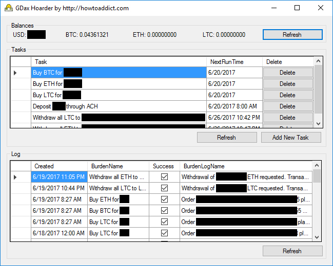

# GDax Hoarder - Pile up virtual currencies with Dollar Cost Averaging

Few months back (when BTC was $1000 ;) I wrote pretty well accepted post on /r/bitcoin subreddit. In it [I describe my experience of riding Bitcoin rollercoaster completely stress free](https://www.reddit.com/r/Bitcoin/comments/5nvd4k/how_i_am_riding_bitcoin_rollercoaster_completely/). Here is the link if you are interested in detailed reading:

https://www.reddit.com/r/Bitcoin/comments/5nvd4k/how_i_am_riding_bitcoin_rollercoaster_completely/

TLDR: Dollar Cost Average your Bitcoin purchases. Say you don't need $1 per day. Turn that $1 into Bitcoin and store it. Looking back, it worked pretty well for me.

Unfortunately, most exchanges I've subscribed to don't even have auto-purchasing option. Those that have it lack options - like Coinbase currently only supports BTC auto-purchases. And they charge fee for each purchase.

So, [after getting Nano Ledger S (of course I've wrote about it)](https://www.reddit.com/r/Bitcoin/comments/5v0c8p/finally_got_hardware_wallet_for_btc_first/) I've decided to write small app that'll spare me of repetitive tasks. App that'll do weekly ACH deposits, Dollar Cost Averaging (DCA) purchasing of Virtual Currencies and finally automatic withdrawals.

After testing for past few weeks, I now feel pretty confident about letting app into the wild. The more HODLers and HOARDers we have, the better. 

## Notable Updates since first Release

 - 2017-12-19 Added support for purchasing Bitcoin Cash (BCH)
 - Look at [this issue for possibly running GDaxHoarder on OSX and Linux platforms](https://github.com/howtoaddict/GdaxHoarder/issues/1). Thanks to @Skeyelab and @donaldsteele
 - If someone goes through code and wants to vouch that it doesn't do anything funny for peace of mind of others, please open new issue. I'll gladly link to your code review from this Readme

## DISCLAIMER

I do plan on maintaining this app and taking feature requests into consideration. However, keep in mind this is a hobby project. As all programmers I am busy with my full time job. And I may start working on something that you see as completely useless... like porting codebase to Python instead of implementing support for another exchanges.

THE SOFTWARE IS PROVIDED "AS IS" AND THE AUTHOR DISCLAIMS ALL WARRANTIES WITH REGARD TO THIS SOFTWARE INCLUDING ALL IMPLIED WARRANTIES OF MERCHANTABILITY AND FITNESS. IN NO EVENT SHALL THE AUTHOR BE LIABLE FOR ANY SPECIAL, DIRECT, INDIRECT, OR CONSEQUENTIAL DAMAGES OR ANY DAMAGES WHATSOEVER RESULTING FROM LOSS OF USE, DATA OR PROFITS, WHETHER IN AN ACTION OF CONTRACT, NEGLIGENCE OR OTHER TORTIOUS ACTION, ARISING OUT OF OR IN CONNECTION WITH THE USE OR PERFORMANCE OF THIS SOFTWARE.

## SETUP

Now that mandatory disclaimer section is out of the way, let's proceed with setup instructions:

 1. Ensure you have [.NET Framework 4.5 installed](https://www.microsoft.com/en-us/download/details.aspx?id=30653). Follow the link you don't. If you are on Windows 8 or newer - you have it. Yeah, I know: mandatory updates suck.
 2. [Grab the latest release from Releases page](https://github.com/howtoaddict/GdaxHoarder/releases/). Extract it in directory of your choice.
 3. Start GdaxHoarder.exe and you'll be presented with Setup dialog. You basically need to provide app with [GDax API keys so that it can interact with your GDax account. Visit: https://www.gdax.com/settings/api
 4. On that page select Permissions you want to grant to API Key. Ideally you want to check all Permissions. However if you don't want to deposit / withdraw through app, and only want to auto-trade then allow View & Trade permissions.
 5. Copy Passphrase, Api Key and Secret Key into form. App will create `.keys` file with this data in folder. Note that this text file is not encrypted. If you change Api Key values in the future you can directly update them in this text file.
 6. Start adding desired tasks. If you want to purchase $5 of BTC daily - do it. Or $10 ETH every 7 days. Or $100 LTC every hour.
 7. If you allowed Transfer with Bypass Two-Factor Auth, you can setup ACH Deposits and Withdrawals to your VC wallets. Note that ACH deposits take up 7 days. So you'll likely need to manually perform first deposit and once it arrives you can setup daily buys + weekly deposits.

## Where to go from here?

To the moon, obviously. If you have issue feel free to leave it here on GitHub. Or you may try to [reach me over on Reddit](https://www.reddit.com/user/howtoaddict). And be sure to [check out world's awesomest website/blog](http://howtoaddict.com).

## TODO list

I'll try to knock down at least 1 TODO every week. DCAing and HODLing VCs has been one of the most profitable decisions I've made in my somewhat successful life. So I like tinkering with code that reminds me of my success.

Current TODO list:

 - Editing Tasks
 - Withdrawal of certain amount of VC once it's reached

## FAQ

 - Why don't you make a website and spare me of downloading, installing and setting this up on my computer?
 
 Well, I would need to get hosting and pay for it. Then I would need to persuade people to trust me with their API Keys. Finally I would need to encrypt and secure data. Too much responsibility, too little benefit. 

 What I would ideally like to see is DCA tools integrated into exchanges. Like, if GDax natively supported automatic deposits, daily purchasing $10 of BTC and automatic withdrawals to your wallet.

 If you have exchange and are looking to implement Dollar Cost Averaging tools - just drop me a line... I'll gladly do DCA tools for your customers so they can auto buy more VCs.

 - How do I know that your app will not steal all my moneyz?

 If you know C# - just read codebase. If you don't know C# - well, there is no way you can know what my app will actually do under the hood.

 - I feel depressed... mindless browsing brought me to this page. What should I do?

 See if watching this will help: https://www.youtube.com/watch?v=5-sfG8BV8wU Also, [I often write self improvement, motivational pieces](http://howtoaddict.com/category/daily-motivation/) - you may find those useful.

